In this blog post I will show you how to sync an [Intellij IDEA](https://www.jetbrains.com/idea/) project with a remote server (called *deploying* the project to a server), and how to debug remote runs of that project.

## Related Guides

Intellij has its own guides on these topics, check them out here:
* Intellij [Deployment Guide](https://www.jetbrains.com/help/idea/tutorial-deployment-in-product.html#before)
* Intellij [Remote Debug Guide](https://www.jetbrains.com/help/idea/tutorial-remote-debug.html)

## Introduction

[Intellij IDEA](https://www.jetbrains.com/idea/) is an incredibly powerful IDE. If you're anything like me, it's become an essential component of any Java program you write. However, compiling and running large applications on my laptop gets frustratingly slow. Since I have access to bigger and better machines, I want to compile and run on those remote servers. However, I need several things before this actually improves my workflow

1. Keeping the local and remote in sync should be easy *without* using git
1. Debugging applications running on the remote should be push-button
1. All file-editing should be performed locally (I want the power of Intellij without having to set up X-forwarding, etc.)

(1) and (3) can be achieving using [*deployment*](#deployment): setting up a remote clone of a project that Intellij syncs in the background. (2) can be achieved using [remote debug](#remote-debug). 
In the rest of the blog, I'll show you how to set this up using an example project. The example project is publicly availble at my github: **TODO**.

## Setup

I'm running Intellij 2021.2.1. Any recent version of Intellij should work. You'll need to first set up SSH for your remote server, which I'll call `remote`. For instance, you should be able to successfully run
```bash
ssh remoteUserName@remote 
```
I'll assume that your SSH key is located in `~/.ssh/id_rsa`. Password-based authentication is a similar process.

For this example, we'll start by making a new Java project using the [Maven](https://maven.apache.org/) build system.

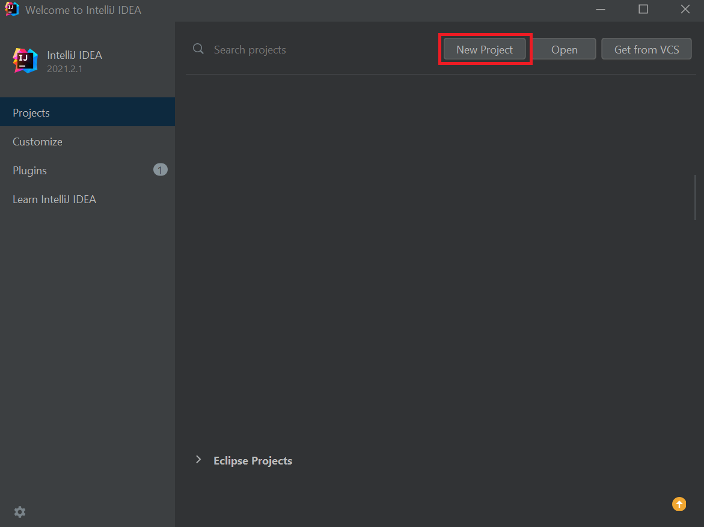

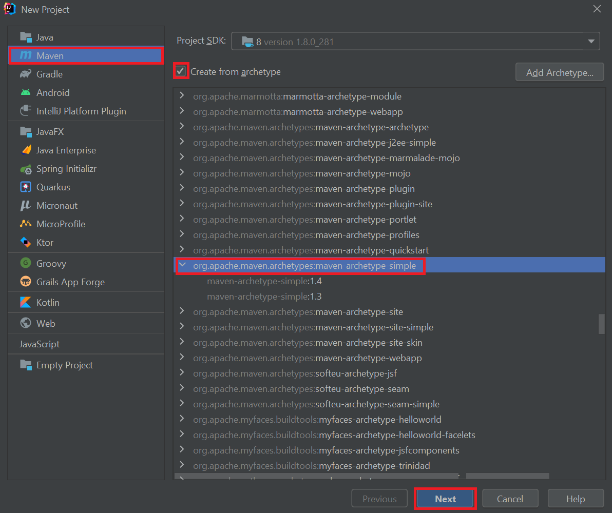

Now we're ready to set up for deployment!

## Deployment

First, open the deployment configuration by going to `Tools` `>` `Deployment` `>` `Configuration`

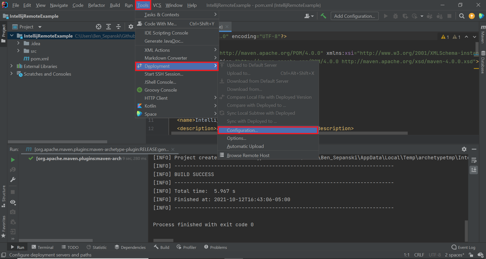

Click `+`, and add an SFTP server. Choose whatever name you want, it doesn't matter.

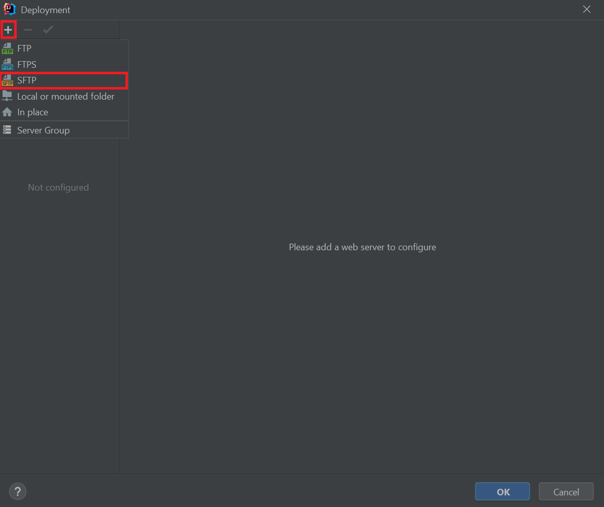

On your remote, pick some path where you want your remote to be rooted. I'm going to use `~/intellijRemotes/<projectName>`.

```bash
myRemoteUserName@remote> mkdir ~/intellijRemotes/IntellijRemoteExample
```

Then, enter the path into the "Root path" entry of your server.

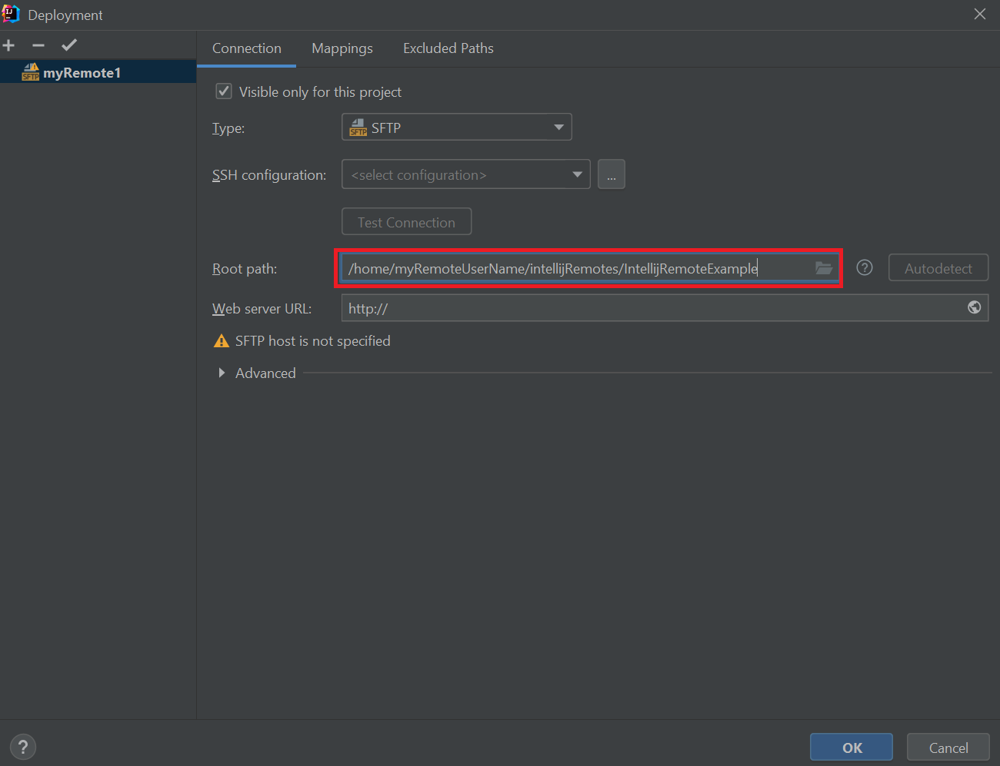

If you already have an SSH configuration setup on Intellij for your desired server, go ahead and select. Otherwise, let's set one up!
Click the three dots next to SSH configuration to get started:

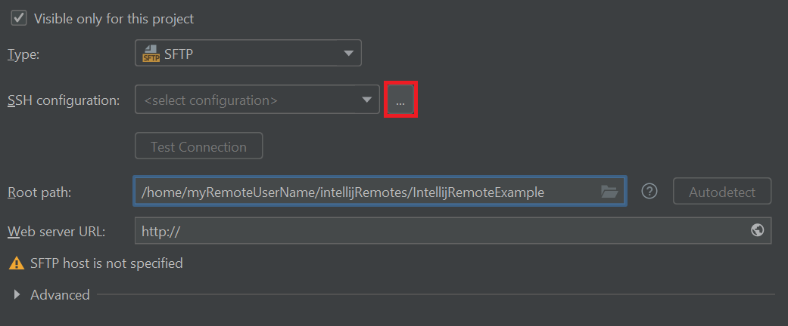

Enter the host, your remote username, and select your authentication status. I'm going to assume you're using a password-protected private key in `~/.ssh/id_rsa`. Only change the port from 22 (or set the local port) if you know what you're doing! 

Once you're done, press "Test Connection" to make sure it works.

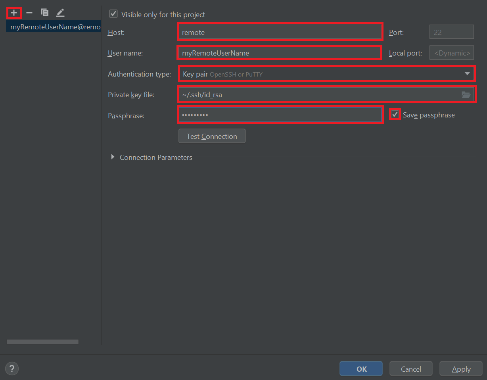

Press OK, then make sure your remote is in bold on the left menu. If it is not, select it and press the check mark to make it the default configuration.

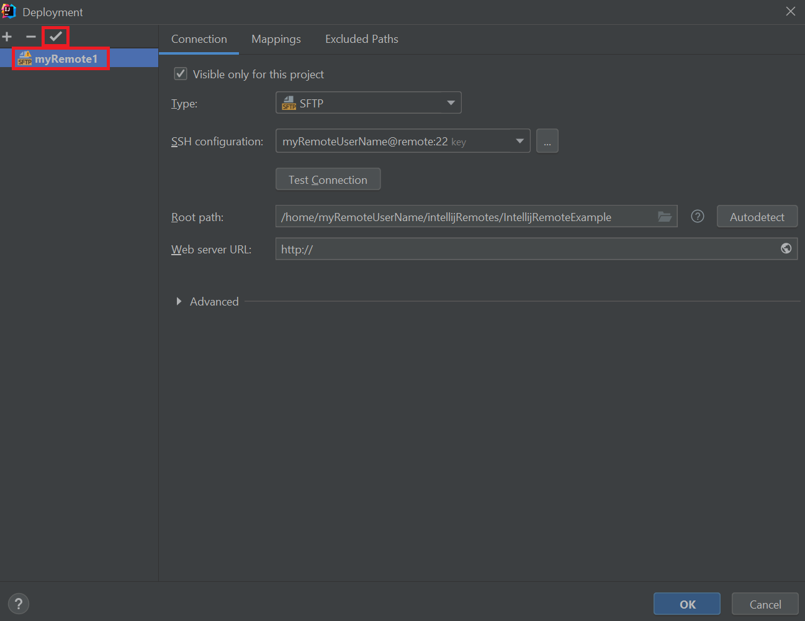

Finally, we need to set up the file mappings. Click on "Mappings", and copy the path to the deployed project on your remote.

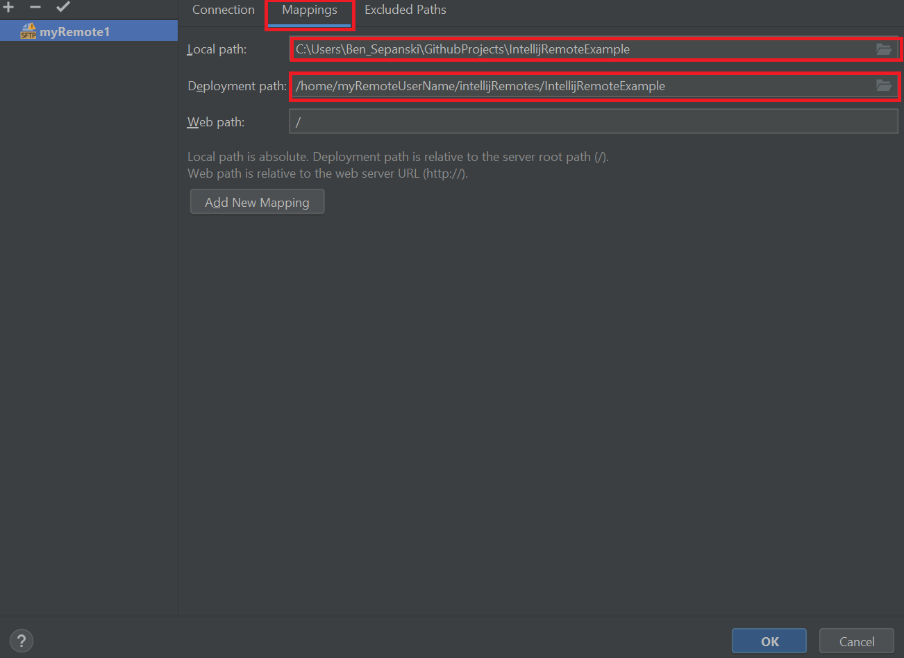

Press OK, and now you're good to go!
What exactly does that mean?

1. Any file you save locally will be automatically uploaded to your remote
2. You can upload, download, or sync any file or directory in you project by
    * Right-clicking the file or directory
    * Click "deployment"
    * Select either upload, download, or sync

Look over some options by going to `Tool` `>` `Deployment` `>` `Options`


- [x] Delete target items when source ones do not exist
    - This is useful to avoid confusing errors where you've deleted on locally, but Intellij does not delete the remote. I'd recommend setting this as long as you're not using the remote to backup files.
- [x] Create empty directories
    - Have intellij create empty directories when you upload. This is helpful if you're outputting things to an empty directory, and want it to be created on the remote when you create it locally.


You can also exclude items by names/patterns at this menu. Another place you can exclude specific paths for specific remotes is by clicking `Tools` `>` `Deployment` `>` `Configuration` and select "Excluded Paths".

Note that you can create multiple remotes by repeating this process! Intellij only automatically uploads changes to the default, all other uploads, downloads, and syncs have to be manual.

## Remote Debug

Intellij's debugger is one of its most powerful features. There's no reason you should lose that just because you want to run your program remotely.

First, we're going to build a [configuration](https://www.jetbrains.com/help/idea/run-debug-configuration.html) that will help us connect to our remote application. Start by clicking "Add configuration."

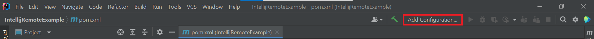

Click the `+` on the top left, and select "Remote JVM Debug".

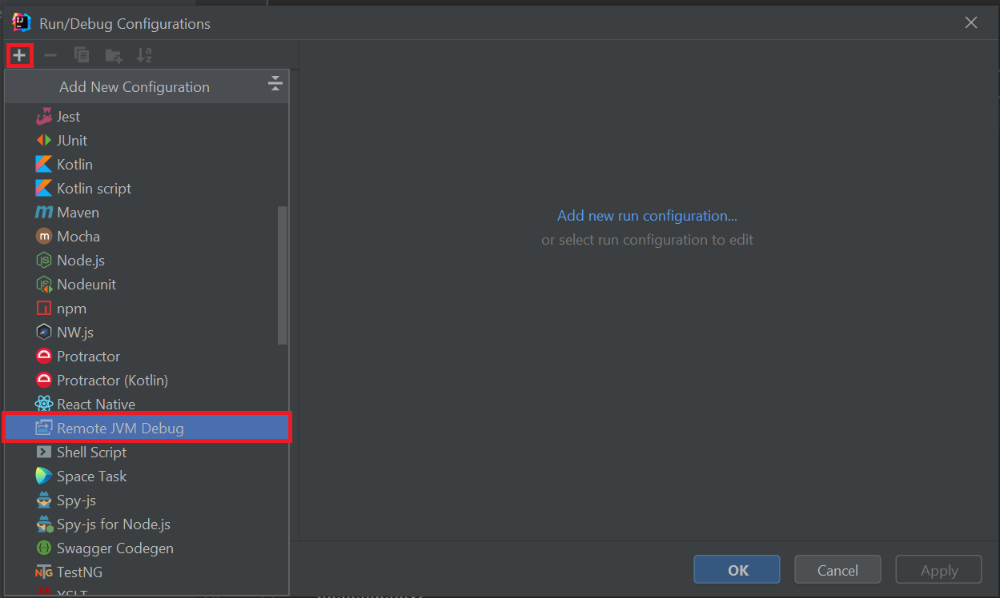

Name the configuration whatever you want. Enter the host-name, and whatever port you want to use to connect. If you have several maven projects/sub-projects, make sure to select the correct module classpath!

I usually use port 8000, but all that matters is that TCP connections can be made from your local IP address to your remote at that port (you can use [this guide](https://www.acronis.com/en-us/articles/telnet/) to figure out which ports are open).

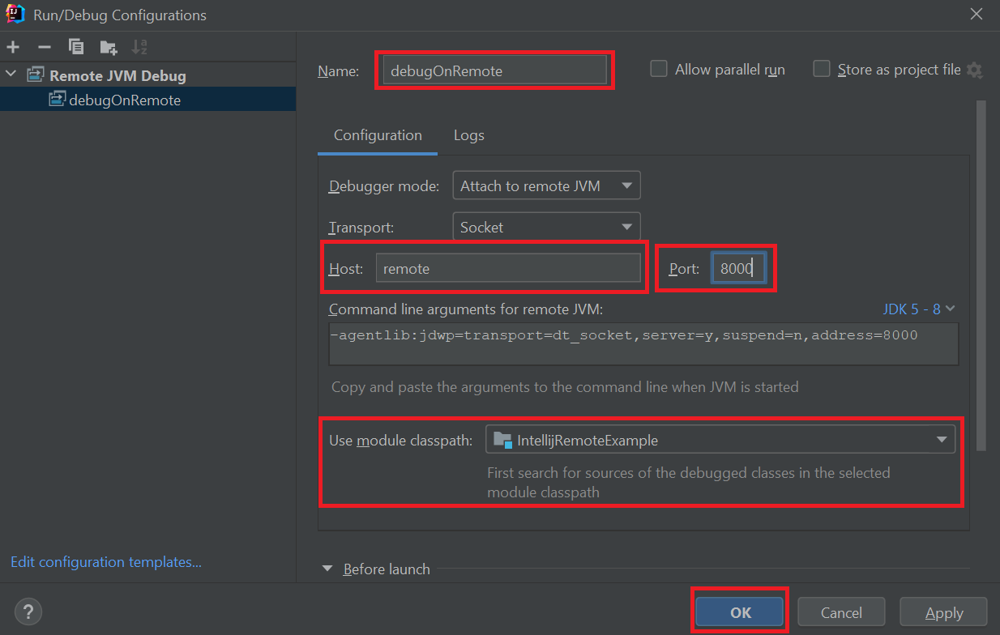

Next, you'll want to copy the "Command line arguments for remote JVM." You're going to need these arguments later.

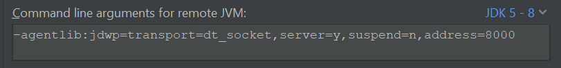

 Once you're done, press "OK".
 
 Now, SSH into your remote, and run your application using the arguments you copied.
 
 ```
 myUserName@localhost> ssh myRemoteUserName@remote
 myRemoteUserName@Remote> java \
     -agentlib:jdwp=transport=dt_socket,server=y,suspend=n,address=8000 \
     -jar myApp.jar
 ```
 You should see this as output:
 ```
 Listening for transport dt_socket at address: 8000
 ```
 Now open up your local Intellij and run the configuration you just created! It should connect, and start debugging like normal.
 
 Note that all terminal output from your application will appear on your remote terminal, not on the local Intellij terminal. However, the Debugger tab will work just like normal.


## Common Pitfalls

I hope this tutorial was helpful for you! Before I let you go, I'd like to warn you of a couple pitfalls that I commonly ran into when I first started using this setup.

1. Intellij only syncs changes made by saving/deleting files. If you switch git branches, you'll need to manually sync with the remote.
2. Sometimes, the Intellij remote debug application continues running after the remote application has stopped. Make sure to manually stop it locally to avoid dead processes clogging up your remote machine. If necessary, use `htop` to check for and kill these processes.
3. If you use multiple remote deployments, only one can be the default at a time. You'll have to manually sync other changes.
4. If you click `Tools` `>` `Deployment` `>` `Upload to ...` (resp. `Download`, `Sync`) it will only `Upload` (resp. `Download`, `Sync`) the file which is currently open. To `Upload` (resp. `Download`, `Sync`) the entire project, you need to right-click on the directory from the `Project` tab.


